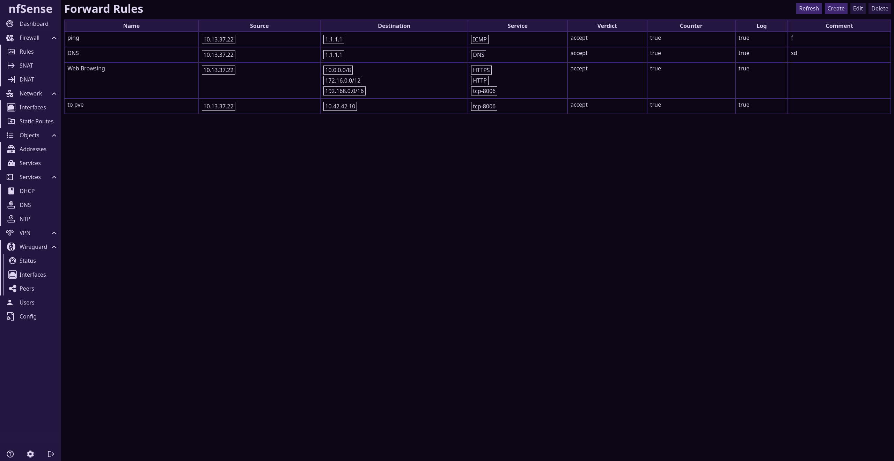

# nfSense
A Linux Based Firewall with nftables



## Development Installation
You can install nfSense for development on a Fresh Debian Trixie System by running the following commands:

```
cd /opt
git clone https://github.com/speatzle/nfsense.git
cd nfsense
./install.sh
```

After the Installation is complete you will need to login to the web interface at https://<your-ip>:8080 with the user root and password nfsense.
Configure the Network interfaces, your default route and apply the Changes.
Otherwise there will be no network connectivity after reboot.

## Features
- Firewall and NAT Rules with Reusable Service and Address Objects Based on nftables
- Interface and Route Configuration
- Builtin DHCP, DNS and NTP Servers
- Wireguard VPN
- A Commit Based Configuration System with Fast Commits and Rollbacks on Failure, saved to disk in JSON
- Intuitive Web Interface
- Written in Memory Safe Rust

Note: nfSense is currently in an early alpha state and is not ready for production use.
