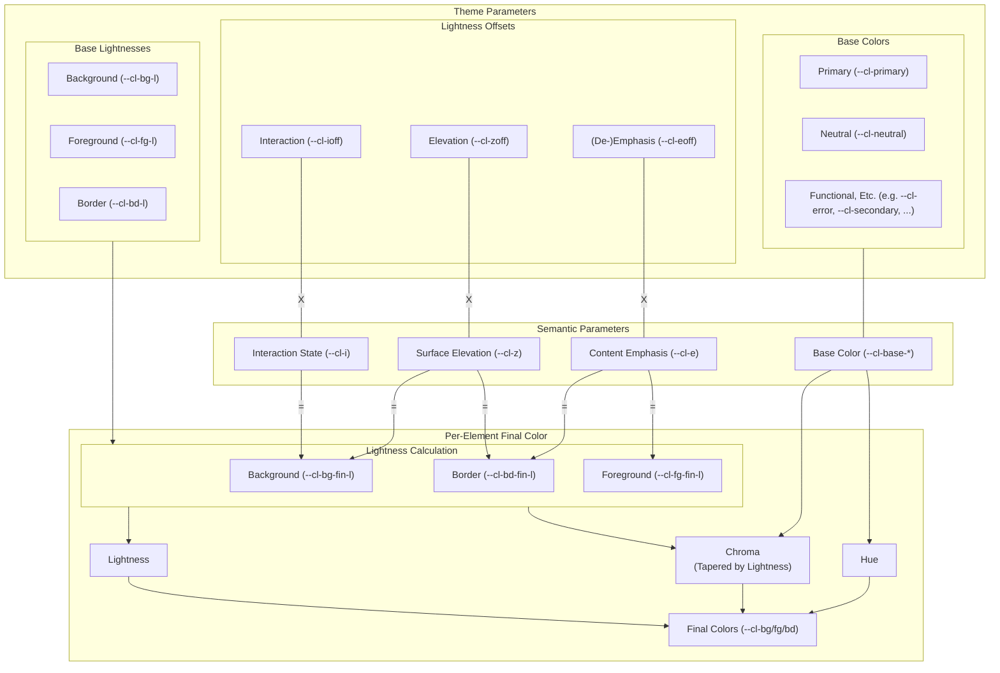

# Global Styles
This folder contains stylesheets which contain rules that apply to everything in the project.

## Colors: Cascading Color Design System

CCDS uses OKLCH and a small set of *cascading semantic parameters* for elevation, interaction state and content emphasis to derive final lightness for every element's background, foreground, and border. They compose with *base values for lightness, hue and chroma* to create a perceptually uniform system where visual hierarchy emerges naturally from semantic markup. Theme switching becomes trivial by overriding only a small subset of base values.

The following diagram illustrates how colors are derived:

